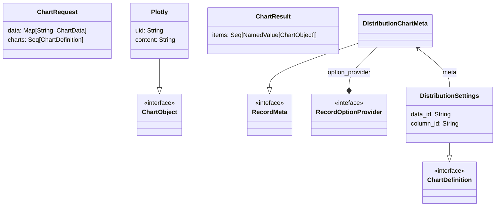

## Chart

```mermaid
classDiagram-v2

class ChartRequest {
    data: Map[String, ChartData]
    charts: Seq[ChartDefinition]
}


class ChartDefinition {
    <<interface>>
}

class DistributionSettings {
    data_id: String
    column_id: String
}

DistributionSettings --|> ChartDefinition

class ChartObject {
    <<interface>>
}

class Plotly {
   uid: String
   content: String
}

Plotly --|> ChartObject

class ChartResult {
    items: Seq[NamedValue[ChartObject]]
}

class RecordMeta {
    <<inteface>>
}

class RecordOptionProvider {
    <<inteface>>
}

class DistributionChartMeta {
    
}

DistributionChartMeta --|> RecordMeta
DistributionChartMeta --* RecordOptionProvider: option_provider
DistributionChartMeta <-- DistributionSettings: meta
```